> [!CAUTION]
> Quick Start: Click the green Use this template button to clone the repo. Once opened in Godot, Reload Current Project to fix initial import issues.
> 
> Documentation In Progress: Video guides are coming soon. The video below is a temporary placeholder.

  

## 🪷 Philosophy
**Four core pillars**: `Controller First` design automatic focus and neighbor assignment. `Instance on Demand` keeps performance high by only spawning nodes when needed. `Run-Any-Scene` allowing you to test any scene in isolation. `The Godot Way` leveraging what makes godot great Resources, Signals, and Composition.

> [!TIP]
> Every major feature includes a `YouTube` link at the top of the script. We utilize `Playground.tscn` for in-game documentation, following the [Robin-Yann Storm](https://www.youtube.com/watch?v=5PJRCz0t7yY) philosophy.

---

## 📂 Web-Inspired Architecture
Feature-based structure: everything is contained in its own folder with its `.tscn`, `.gd`, and `.tres`. It comes ready with standard addons and global managers for `Data Saving`, `Global Signals`, & more. Also included is a library of plug-and-play components like `Health`, `Hitboxes`, and `Hurtboxes` for fast prototyping.

  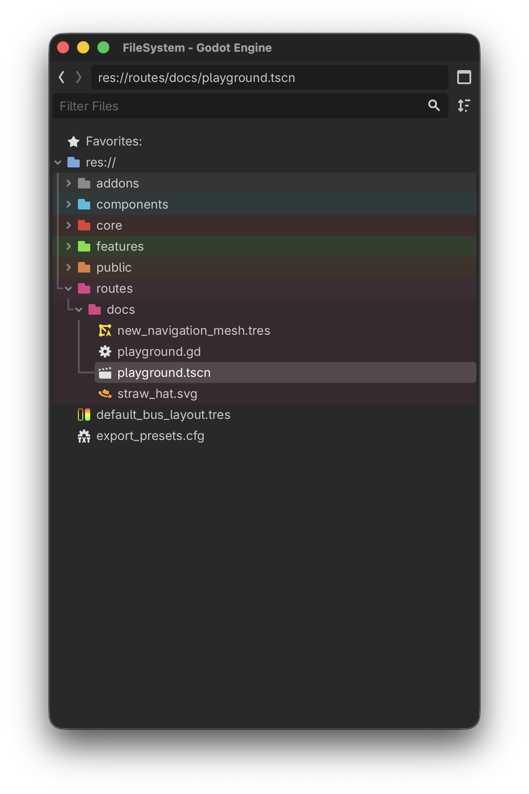
  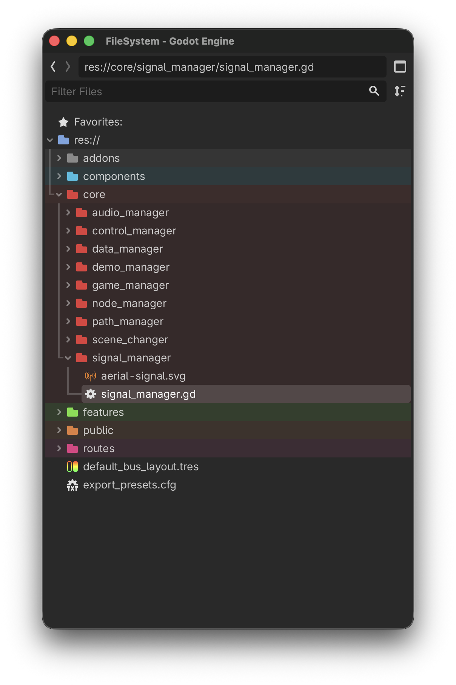
  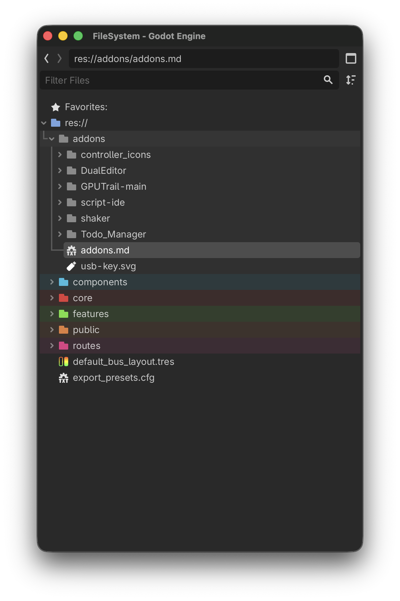
  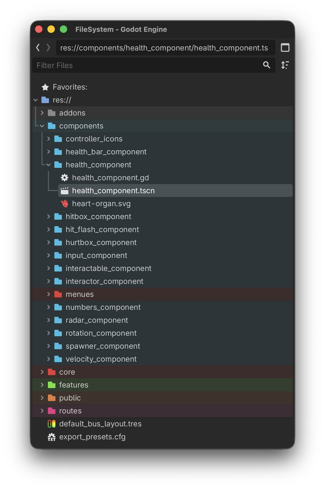

## 🧩 Menu Systems
Comes ready with a `Boot Splash`, `Main Menu`, `Pause Menu`, and `Options Menu`. All menus are instanced on demand via the `Game Manager`, while the `Scene Changer` handles smooth transitions.

  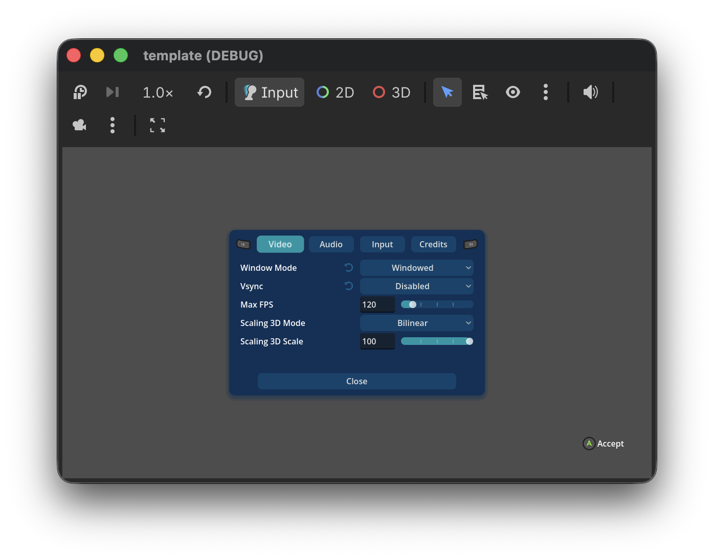
  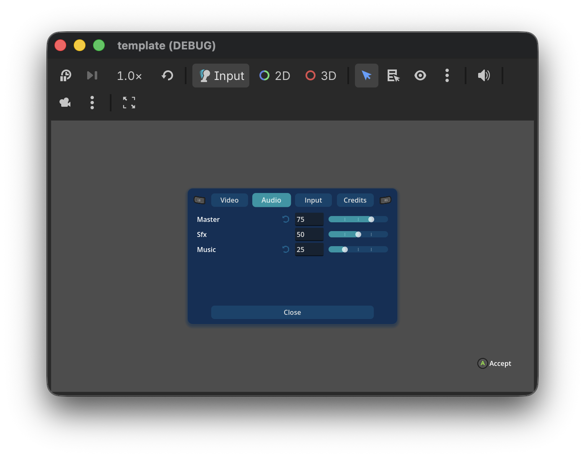
  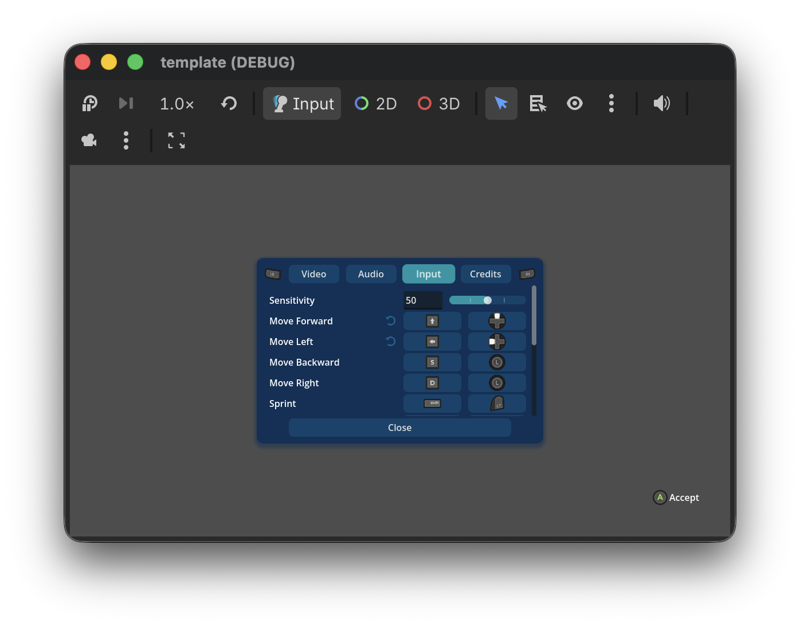
  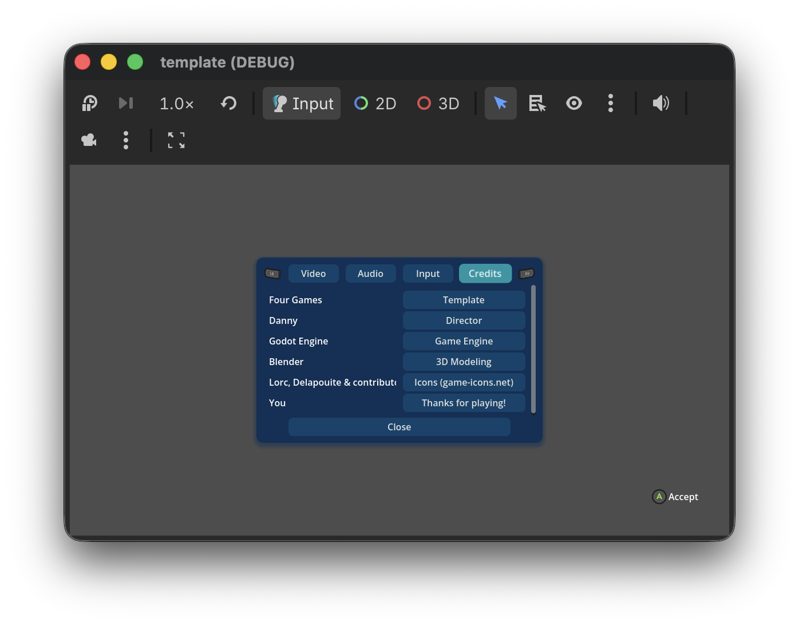

## 🚀 Automated Build & Deployment
To use the included GitHub Actions, simply configure your repository `Secrets` and `Variables` as shown below.

  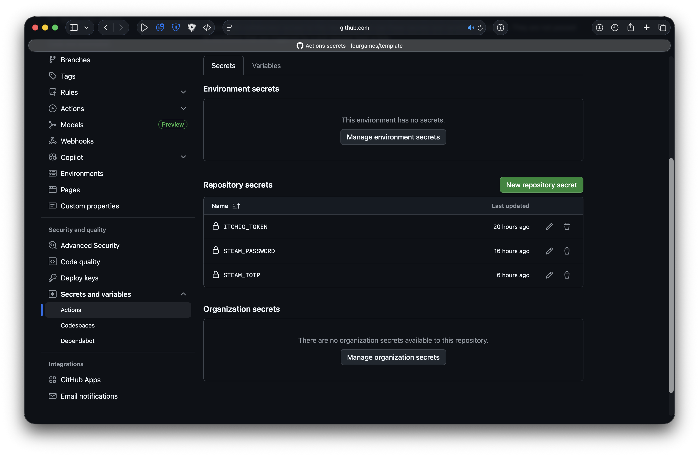
  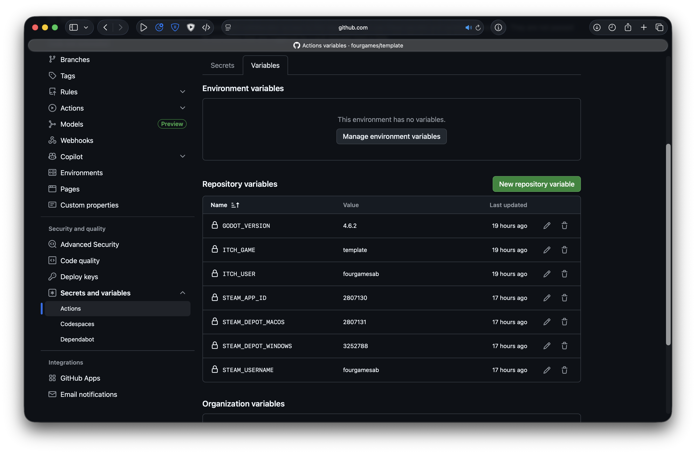

## 📚 Resources
The Game Success Formula & curated resources for game development. Tools and strategies for making better games, with a focus on Godot.

  <a href="https://github.com/fourgames/resources">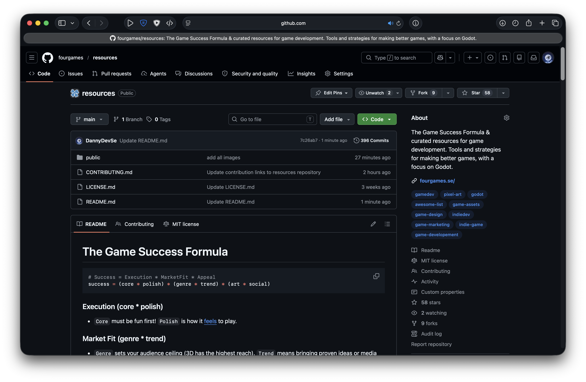</a>

## 🍀 Powered by Four Games

  
  
  
  

> [!TIP]
> Click on any thumbnail to jump directly to the source.
